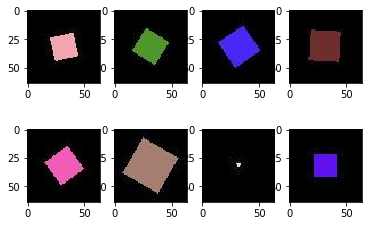
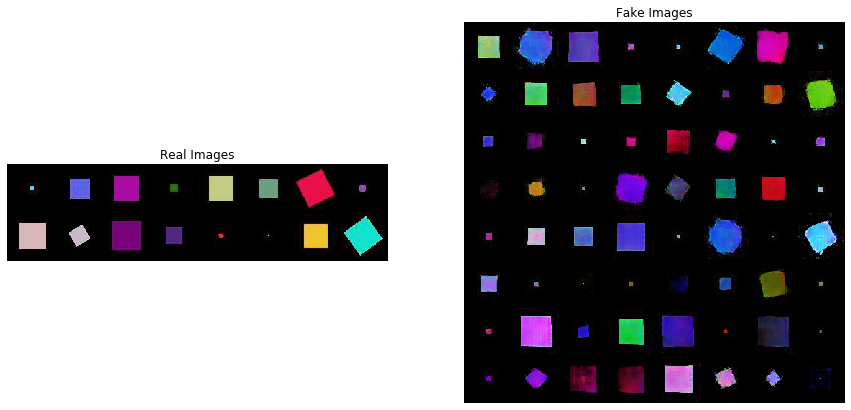

# GenerateSquares-GANs
I created a dateset of squares of random colors,sizes and orientation using a Python script. Then, I followed a PyTorch tutorial on DC-GAN- https://pytorch.org/tutorials/beginner/dcgan_faces_tutorial.html to train a DC-GANs to generate squares.

The file Generate_squares.ipynb contains the code to generate sqaures of random sizes, colors and orientation as seen below-

The file Squares_GAN.ipynb contains the PyTorch tutorial using which I trained a DC-GAN to generate random squares. The results I got after training the GAN are-

